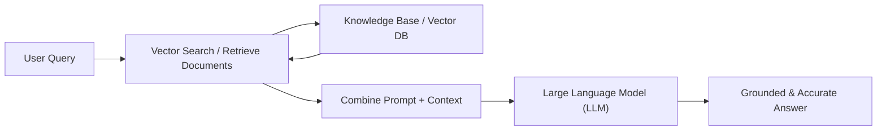

# Session 1: Introduction to RAG & Why It's Needed

---

## Task 1: What is RAG & Everyday App Example

### Definition of RAG:
**Retrieval-Augmented Generation (RAG)** is an AI framework that enhances Large Language Models (LLMs) by connecting them to external, dynamic knowledge sources (such as vector databases, enterprise APIs, live web searches, or local document stores). 

Instead of relying solely on the static, pre-trained parameters of an LLM—which can lead to outdated information or hallucinations—RAG operates in two main phases:
1. **Retrieval**: When a user inputs a query, the system converts the query into a numerical vector (embedding) and searches an external database to retrieve relevant contextually matched document chunks.
2. **Generation**: The retrieved context chunks are concatenated with the original user query inside a rich system prompt and passed to the LLM. The LLM then generates an accurate, context-grounded response citing the retrieved data.

### Everyday App Example: Zomato / Flipkart / Instagram
* **Feature**: **Zomato Smart Food & Restaurant Recommendation Bot**
* **Without RAG**: If a user asks Zomato's AI chatbot, *"What is the best butter chicken near me that is open right now and offers 20% discount on HDFC cards?"*, a standard pre-trained LLM would fail because it does not have access to real-time restaurant open status, current menu offerings, or live bank promotional offers.
* **With RAG**: When the user submits the query, Zomato's RAG system retrieves live context from Zomato's database (current restaurant hours, dish ratings, live discounts, user GPS location) and feeds these structured facts to the LLM. The LLM then generates a personalized, perfectly accurate answer: *"Grand Punjab Express (1.2 km away) is open until 11 PM, serves top-rated Butter Chicken (4.8★), and automatically applies 20% off with HDFC cards!"*

---

## Task 2: Outdated LLM Limitations (IRCTC / IPL 2024 Scenario)

Imagine a travel assistant bot powered by an LLM trained in **2022**.

### 3 Questions the Bot Struggling to Answer:
1. **IRCTC Train Schedule & New Trains**: *"What is the departure time and platform for the newly launched Vande Bharat Express from Ahmedabad to Mumbai Central?"*
   * **Why it fails**: Vande Bharat routes and schedules change dynamically, and new routes were inaugurated after 2022. The 2022 LLM either confesses ignorance or hallucinates non-existent timings.
2. **IPL 2024 Winner & Match Stats**: *"Who won the IPL 2024 final and who was awarded Player of the Tournament?"*
   * **Why it fails**: IPL 2024 occurred two years after the model's knowledge cutoff (2022). The bot cannot know the 2024 champion (Kolkata Knight Riders) or player statistics.
3. **IRCTC Dynamic Ticket Fare & Live Running Status**: *"What is the current waitlist status and ticket price for Rajdhani Express today?"*
   * **Why it fails**: Live seat availability and dynamic pricing change second-by-second. Static weights can never store live transactional data.

### Why Outdated LLM Knowledge is a Problem:
* **Hallucination Risk**: When asked about post-cutoff events, LLMs often fabricate plausible-sounding but completely false facts (e.g., naming the wrong IPL winner).
* **Loss of Trust**: Users relying on outdated train schedules will miss trains or book wrong routes.
* **Inability to Update Static Weights**: Re-training a 70B parameter LLM every day to learn new train schedules or sports scores costs millions of dollars and is computationally unfeasible. RAG solves this by decoupling knowledge retrieval from model parameter updates.

---

## Task 3: RAG Basic Workflow Diagram

### Workflow Steps:
`User Query → Retrieve Documents → Combine with LLM → Generate Answer`

#### Detailed Diagram Illustration:

---

## Task 4: Comparison Table — RAG vs. Fine-tuning vs. Prompt Engineering

| Feature / Metric | Retrieval-Augmented Generation (RAG) | Fine-tuning | Prompt Engineering |
| :--- | :--- | :--- | :--- |
| **Cost** | **Low to Moderate** (Only cost is embedding creation & vector DB storage; standard API inferencing). | **High** (Requires dedicated GPU compute clusters for backpropagation across billions of parameters). | **Very Low** (Zero training cost; slightly higher token cost per prompt). |
| **Data Freshness** | **Real-Time / Dynamic** (Instantly updates by adding/updating document vectors without re-training). | **Static / Delayed** (Requires periodic re-training jobs to update knowledge; snapshot in time). | **Dynamic (Limited)** (Requires manual context pasting into context window limit). |
| **Use Case Example** | **Zomato Live Menu & Deal Search / Company HR PDF Q&A Bot** | **Adapting Llama-3 to speak in Medical / Legal terminology or JSON output formatting** | **Asking ChatGPT to reformat text into bullet points or persona roleplay** |
| **Speed of Implementation** | **Fast** (Hours to days using frameworks like LangChain, LlamaIndex, FAISS, ChromaDB). | **Slow** (Days to weeks for dataset curation, hyperparameter tuning, evaluation, and deployment). | **Immediate** (Seconds to minutes; simply writing prompt text). |

---

## Task 5: Real-World Industry RAG Case Study (Not Shown in Class)

### Industry Example: **Notion AI (Knowledge Base Q&A)**
* **Overview**: Notion implemented RAG across millions of user workspaces to power **Notion Q&A**.
* **How Notion Uses RAG**:
  1. When a user asks Notion AI: *"What are our Q3 marketing goals and who is leading the launch?"*, Notion converts the query into vectors.
  2. Notion performs a vector similarity search across all documents, meeting notes, and wiki pages accessible to that specific user in Notion's vector store (Pinecone / Qdrant).
  3. The top relevant chunks are retrieved while respecting strict permission filters (role-based access control).
  4. The retrieved context is passed into Anthropic Claude / OpenAI GPT-4.
* **Benefits Provided**:
  * **Zero Hallucination**: Answers are strictly backed by company notes with direct link citations to the exact Notion page.
  * **Real-Time Updates**: As soon as a employee edits a page, the updated text is re-indexed so the AI knows the new information immediately.
  * **Enterprise Security**: RAG allows Notion to restrict context retrieval based on workspace user permissions without leaking data across accounts.
